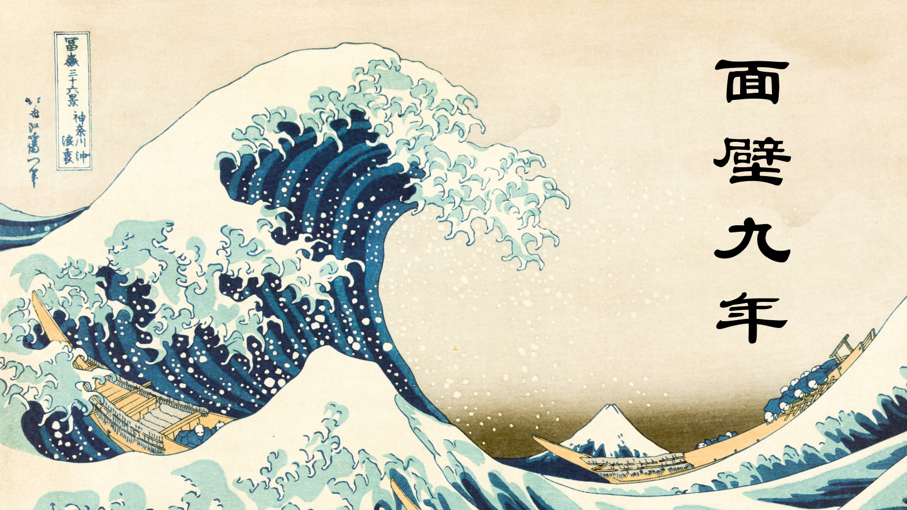

<h1 align="center">🌊 Welcome to My GitHub 🌊</h1>

# Hi there, I'm Gentoku 👋
## <picture></picture> About me
<tr border="none">
<td width="50%" align="left">

I am a passionate Full Stack Engineer specializing in core system development for the finance and insurance industries. I have a proven track record of building reliable systems, covering everything from requirement definition to maintenance and operations.

> I take pride in building scalable systems and solving complex problems with a passion for efficient, elegant solutions.　　　　My journey is driven by a love for problem-solving and delivering high-quality software that makes an impact.

---

## 🛠️ One I've used 🛠️

### 💻 Programming Languages

### 🗄️ Databases

### 🚀 Cloud & DevOps

### ♾️ Software & Tools

### 📝 IDE / Editors

### 🖥 Operating Systems

---

## 📊 GitHub Overview

  

<table border="0" width="100%">
  <tr>
    <td width="50%">
      
    </td>
    <td width="50%">
      
    </td>
  </tr>
</table>

<table border="0" width="100%">
  <tr>
    <td width="50%">
      
    </td>
    <td width="50%">
      
    </td>
  </tr>
</table>
